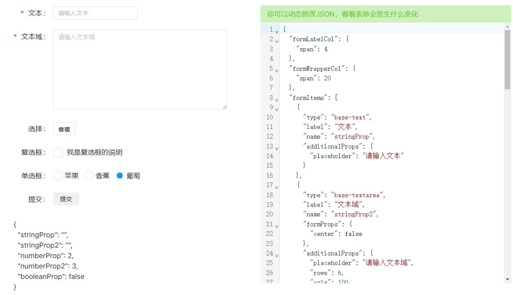

# vue-dynamic-form

A data driven form component for vue3.

## Documention

[Documention](https://docs.imengyu.top/vue-dynamic-form-docs)。



## Install

```shell
# npm 
npm i @imengyu/vue-dynamic-form

# or yarn
yarn add @imengyu/vue-dynamic-form
```

## Introduction

In the management system development, we often use form submission data, and form submission data takes up most of the development time.
When the form is very large, manually writing the form components can be a hassle. vue-dynamic-form was written to solve this problem,
vue-dynamic-form allows you to dynamically generate forms using JSON data. You only need to pass in a JSON containing various description information to render a complete form.

vue-dynamic-form is not required for development, it is just a widget to help you speed up development.

The management system projects used by the author's company have all used dynamic forms, saving 80% of the time of layout forms, and the development efficiency has been greatly improved (you can spend more time to touch the fish 🤭). vue-dynamic-form is now open source, hoping to facilitate your development.

> **This project is still in the early release stage, and there may be many problems. If you encounter any problems, please feel free to submit a issue in [Github](https://github.com/imengyu/vue-dynamic-form/issues), I'll try to fix it for you!**

## Author's other project

* [vue3-context-menu A context menu component for Vue3](https://github.com/imengyu/vue3-context-menu/)
* [vue-dock-layout A Vue editor layout component that like Visual Studio](https://github.com/imengyu/vue-dock-layout)
* [vue-code-layout A Vue editor layout component that like VSCode](https://github.com/imengyu/vue-code-layout)

## License

[MIT](./LICENSE)
