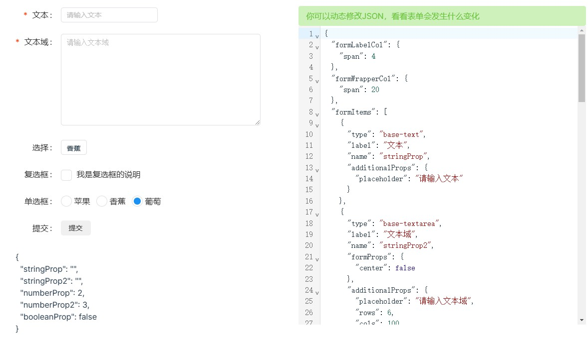

# vue-dynamic-form

A data driven form component for vue3.

vue-dynamic-form 一个用数据驱动的 Vue3 动态表单组件。

## 文档

[查看文档](https://imengyu.top/pages/vue-dynamic-form-docs)。



## 安装

```shell
# npm 
npm i @imengyu/vue-dynamic-form

# or yarn
yarn add @imengyu/vue-dynamic-form
```

## 简介

设计参考了 [阿里的 XRender](https://xrender.fun/form-render)。

在中后台开发中，我们经常会使用表单提交数据，表单提交数据占据开发的多半时间，
当表单特别多时，手动写表单组件是一件非常麻烦的事情。vue-dynamic-form就是为了解决这个问题而写的，
vue-dynamic-form 支持你使用 JSON 数据动态生成表单，只需要传入一个包含各种描述信息的 JSON，就能渲染出一个完整的表单。

vue-dynamic-form 并不是开发中所必须的，它只是一个帮助你加快开发的小组件。

作者公司使用的中后台项目已经全部使用动态表单，省去了80%布局表单的时间，开发效率得到了不少提升（可以用更多时间摸鱼啦🤭）。现在将 vue-dynamic-form 开源，希望可以为你的开发提供便利。

> **本项目目前还处于早期发布阶段，可能会存在不少问题，如果遇到问题，欢迎在 [Github](https://github.com/imengyu/vue-dynamic-form/issues) 提出 Issue，我会尽量为你解决！**

## 支持

作者开发不易，如果这个项目对您有帮助，希望你可以帮我点个 ⭐ ，这将是对我极大的鼓励。谢谢啦 (●'◡'●)

## 作者的其他项目

* [vue3-context-menu 一个简洁美观简单的Vue3右键菜单组件](https://github.com/imengyu/vue3-context-menu/)
* [naeasy-ui-react-native 一款简单的 React Native 移动端UI组件库](https://github.com/imengyu/naeasy-ui-react-native)

## License

[MIT](./LICENSE)
